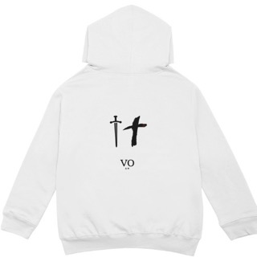
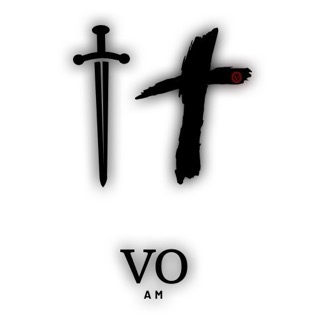

<!DOCTYPE html>
<html lang="en">
<head>
  <meta charset="UTF-8" />
  <meta name="viewport" content="width=device-width, initial-scale=1.0"/>
  <title>VO ENT</title>
  
</head>
<body>

  <header>
    
    <h1>VO ENT</h1>
    
Music • Movement • Merch

  </header>

  <section>
    <h2>🎧 Listen</h2>
    <a class="button" href="https://music.apple.com/us/artist/vito-gwuap/1504520516" target="_blank">Apple Music</a>
    <a class="button" href="https://youtube.com/@vitogwuap?si=PIHjBfMjoZlHWR4v" target="_blank">YouTube</a>
  </section>

  <section>
    <h2>📸 Follow</h2>
    <a class="button" href="https://www.instagram.com/officialvitogwuap?igsh=MWNjNTY5eW16bXZlaA==" target="_blank">Instagram</a>
  </section>

  <section>
    <h2>🛍️ Merch Preview</h2>
    

      
      
White Hoodie – Coming Soon

    

    

      
      
Black Hoodie – Coming Soon

    

     
    <a class="button" href="#">Sign Up for Drop Alerts</a>
  </section>

  <section>
    <h2>🧑‍🎤 About VO ENT</h2>
    
VO ENT is a creative brand powered by raw energy, music, and street culture. Stay tuned for new drops, exclusive content, and the next wave from Vito Gwuap.

  </section>

  <section>
    <h2>🎶 VO ENT Music</h2>

    

      
      <h3>Vito – R8</h3>
      <audio controls>
        <source src="vito_r8.mp3" type="audio/mpeg">
        Your browser does not support the audio element.
      </audio>
       
      <a href="vito_r8.mp3" download class="button">Download</a>
    

    

      
      <h3>Focus Full</h3>
      <audio controls>
        <source src="focus_full.mp3" type="audio/mpeg">
        Your browser does not support the audio element.
      </audio>
       
      <a href="focus_full.mp3" download class="button">Download</a>
    

  </section>

  

    &copy; 2025 VO ENT. All rights reserved.
  

</body>
</html>
